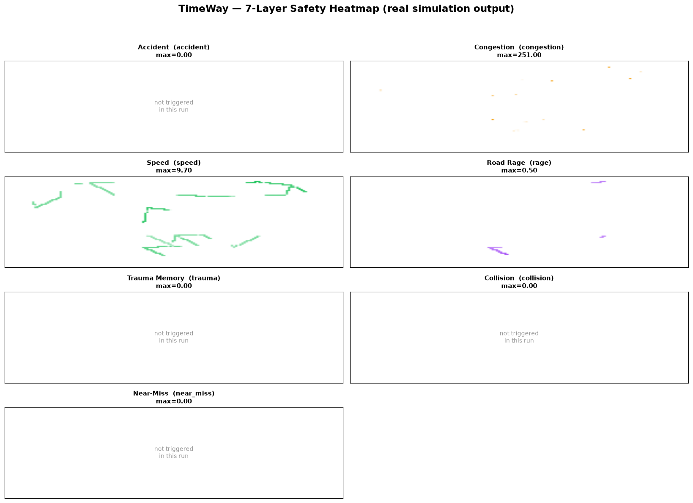
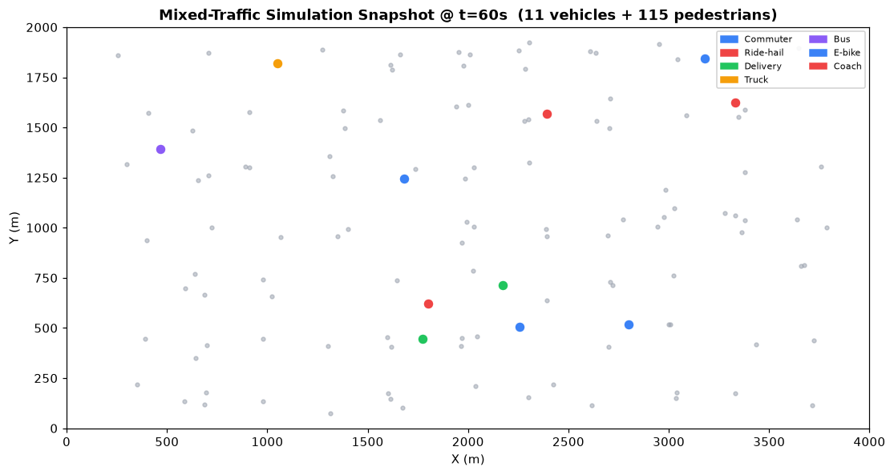

# TimeWay (时途) — Cognitive Micro-Traffic Simulation Platform · Open Core

> **First open-source micro-traffic simulator that dynamically couples driver
> psychological state (road rage / trauma memory / behavioral stress) with
> vehicle physics** — on a Numba-JIT SoA architecture, supporting M1000 mixed
> traffic (cars · pedestrians · delivery · AV), and exporting to OpenDRIVE 1.7
> / OpenSCENARIO 1.2.

[中文版简要](#简介) · [Why different?](#why-timeway-is-different) · [Try it](#quick-start) · [Licensing](#license--dual-licensing)

## Why TimeWay is Different

TimeWay is the **first open-source** micro-traffic simulation platform that
models the driver's mental state as a first-class simulation variable,
not just an external classifier. Concretely:

| Capability | TimeWay | Traditional micro-sim |
|---|:---:|:---:|
| Driver psychological modeling (road rage / trauma) | ✅ dynamic coupling | ❌ or post-hoc only |
| "Event → mind → action → physics" 4-layer architecture | ✅ | ❌ |
| M1000 (1000-vehicle) real-time simulation | ✅ Numba JIT SoA | ⚠️ partial |
| 7-layer safety heatmap (accident · congestion · speed · **rage** · trauma · collision · near-miss) | ✅ | ❌ |
| Determinism (byte-identical replay from same seed) | ✅ MD5 verified | ⚠️ rare |
| OpenDRIVE 1.7 + OpenSCENARIO 1.2 export (keeping Chinese scenario names) | ✅ | ⚠️ English-only elsewhere |
| Cross-validation against SUMO | ✅ | ✅ |
| License | **GPL-3.0 (open core)** | varies |

**The point that matters academically:** TimeWay treats the driver's mind as
a *coupled* subsystem, not a black-box classifier. A road-rage event not only
labels a trajectory; it modifies the driver's subsequent throttle, gap, and
lane-change behavior, which in turn changes traffic flow, which in turn feeds
back into the chance of further mental events. This loop is what most
micro-simulators omit.

## Mixed-Traffic Simulation in Action

This snapshot is **real output** from a 120-second, 11-vehicle, 115-pedestrian
run under the custom scenario (deterministic seed = 42):

Vehicles are colored by profession (Commuter · Ride-hail · Delivery · Truck ·
Bus · E-bike · Coach); pedestrians in gray. The 4 km × 2 km playground
visualizes the **mixed-traffic** condition TimeWay targets — the dominant
reality of urban Chinese roads.

## What This Repository Contains (open layer)

| Path | What's in it |
|---|---|
| [`docs/TimeWay_算法白皮书.md`](./docs/TimeWay_算法白皮书.md) | Algorithm / methodology whitepaper (architecture, determinism verification, SUMO cross-validation) |
| [`docs/md2html_whitepaper.py`](./docs/md2html_whitepaper.py) | Markdown → HTML renderer for the whitepaper |
| [`dsl/`](./dsl) | `.tw` scenario Domain-Specific Language — lexer, parser, IR, OpenSCENARIO transpiler |
| [`demos/osc_demo/`](./demos/osc_demo) | Standard-format scenario examples (OpenDRIVE `.xodr` + OpenSCENARIO `.xosc`), incl. **hydropower construction-site gateway** scenarios |
| [`demos/crash_edge_demo/`](./demos/crash_edge_demo) | Interactive "crash edge" HTML visualization demo (self-contained) |
| [`examples/`](./examples) | Sample `.tw` source for hydropower construction-site traffic-safety scenarios |
| [`assets/`](./assets) | Real-simulation screenshots (above) |

## What This Repository Does NOT Contain (closed core / commercial)

These constitute TimeWay's IP moat. They are **not** in this repository and
must be obtained under a separate commercial license:

- Core simulation engine: `numba_kernels`, `vehicle_soa` (Structure-of-Arrays),
  `spatial_grid` (uniform-grid neighbor index), and all JIT-compiled hot paths.
- Driver psychological evolution model and environment-coupling logic:
  `mental_state`, `env_coupling`, `rule_engine`.
- Seven-layer safety heatmap algorithm and the full safety-metrics stack.
- Enterprise features: high-throughput batch processor, API server, Web app,
  vertical-topic customizations (e.g. hydropower construction-site traffic-safety MVP),
  and pre-calibrated driver-parameter sets for NGSIM-scaled scenarios.

See [`OPEN_CORE.md`](./OPEN_CORE.md) for the boundary rationale and the
dual-licensing model.

## Quick Start

1. **Read the whitepaper** — [`docs/TimeWay_算法白皮书.md`](./docs/TimeWay_算法白皮书.md)
   covers the architecture, the determinism verification (same seed → byte-identical
   `frames.json`), and the SUMO cross-validation results.
2. **Try the `.tw` DSL** — read [`dsl/`](./dsl) for the parser; modify one of
   the scenarios in [`examples/`](./examples) (open-source layer only) or
   write your own.
3. **Open the crash-edge demo** — open
   [`demos/crash_edge_demo/index.html`](./demos/crash_edge_demo/index.html) in
   any browser; it's a self-contained interactive visualization.
4. **Load the standards-format scenarios** — open the files in
   [`demos/osc_demo/`](./demos/osc_demo) with any tool that supports OpenDRIVE
   1.7 / OpenSCENARIO 1.2 (CARLA, esmini, SUMO via netconvert, etc.).

> A note on running the engine itself: the engine lives in the closed core
> and is **not** in this open repository. Academic / educational users may
> request a research-only access via the contact below.

## License & Dual-Licensing

- **Documents are CC BY 4.0, code is GPL-3.0 (dual-track).** The whitepaper
  and other `docs/` texts are licensed under
  [Creative Commons Attribution 4.0 International (CC BY 4.0)](./docs/CC-BY-4.0.txt)
  — reuse with attribution. The code in this repo (DSL parser, demos, etc.)
  remains **GPL-3.0** — see [`LICENSE`](./LICENSE); derived code works must
  also be GPL-3.0.
- **Commercial / enterprise use** (closed-source integration, scaled
  deployment, custom vertical topics, teaching-pack licensing) requires a
  separate commercial agreement. GPL-3.0 explicitly reserves this path:
  the rights holder (TimeWay team) may offer commercial licenses
  independently of the GPL grant.
- This is the standard **dual-licensing** model: the same code base serves
  open-source users (under GPL-3.0) and paying enterprise users (under a
  commercial agreement), with no obligation to GPL the paid editions.

## Brief Intro (简介)

TimeWay（时途）是一个把"**驾驶员动态心智状态**（路怒 / 创伤记忆 / 行为压力）
**作为一等公民**"引入微观交通仿真的开放核心平台。它在 Numba JIT 的
**SoA（结构数组）+ 空间网格**架构上支撑 M1000（1000 车级）的
**人车混行 + 多职业（网约车 / 外卖 / 货车 / 公交 / 救护车 / 消防 / 自动驾驶 / 电动车 / 大巴）**
实时仿真,采集 7 层安全热力图（事故 · 拥堵 · 车速 · 路怒 · 创伤 · 碰撞 · 近冲突），
导出符合 OpenDRIVE 1.7 / OpenSCENARIO 1.2 的标准场景文件,并支持确定性回放
（同种子 → `frames.json` MD5 逐字节一致）。

开放层（**本仓**）包含：算法白皮书、` .tw` 场景 DSL 解析器、标准场景示例、
崩溃边缘交互式 demo、水电站施工场景的 `.tw` 示例。

封闭层（商业授权）包含：仿真引擎核心( `numba_kernels` / `vehicle_soa` /
`spatial_grid`)、驾驶员心理演化与耦合( `mental_state` / `env_coupling` /
`rule_engine`)、7 层安全热力图算法与度量、批处理 / API / Web 服务、
横向课题定制（如水电站施工交通安全 MVP）、NGSIM 校准参数集。

授权路径:开放层以 **GPL-3.0** 发布，衍生作品须同样以 GPL-3.0 开源；
商业 / 企业使用（闭源集成 / 规模化部署 / 定制开发 / 教学包）通过
**双重授权** 模式另行签约,与 GPL 开源许可不冲突。

## Commercial / Academic Contact

- Commercial licensing (场地授权 / 教学包 / 定制开发 / 企业集成):
  see the project official channels (Huangshi Innovation Competition ·
  National Innovation Competition Industry Track #155).
- Academic / research-only access to the closed core: contact via the same channels.

## Disclaimer

This repository is for research and educational demonstration only.
Simulation outputs should not be used directly for real-world traffic-engineering
design decisions without independent professional evaluation.
